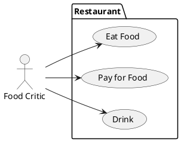
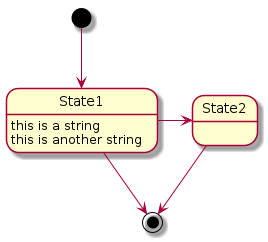

[Lectures](../../README.md#school-lectures)

# Lecture 1 - UML Introduction

This lecture is about familiarizing with UML diagram types. Note that we will not study 
all existing UML diagram types but only those which are commonly used in projects.

## Unified Modeling Language (UML)

UML is used in non-trivial projects for...

- modeling
- documentation
- visualization
- specification
- discussion

UML is not...

- to describe the real world perfectly
- complete in a sense that it captures all facets of the problem
- a programming language
- not specialised for one particular domain
- a replacement for textual descriptions
- agile method or project management approach

#### Model vs Reality


This example should demonstrate that a model is only there to capture the essential parts of an entity in the real world.
If we try to model out every aspect then it is harder to focus on the _important_ parts of a model.

#### Tools to draw UML Diagrams

[Draw.io](http://www.draw.io) is a easy to use website which has many predefined symbols and icons


If you prefer something declaratively then try [PlantUML](http://www.plantuml.com). All diagrams in this script
were created with PlantUML. You can find the sources for the diagrams in the [diagrams](./../../bin/diagrams) directory.



Declaration for the Use Case diagram below.

## Use Case Diagram


The purpose of the use case diagram is to model out:
- all relevant actors inside a use case
- the system context
- the actions (i.e. use cases) an actor can do

In the above example the system context is `Restaurant` in which the actor `Food critic` can
- `Eat Food`
- `Pay for Food`
- `Drink`

### Notation


### Include vs Extend Relationship


The difference between an 'include' vs 'exclude' use case relationship is: 'include' means that a use case is automatically part
of another use case, in the example above: when opening a book, reading is included as a use case.

'exclude' is something optional - in the above example one can open a book and _optionally_ turn a page.

## Class Diagram


Class diagrams are representing

- the hierarchical structure of a system  
- the attributes and methods of classes and interfaces
- the relationships between classes and interfaces

### Notation


### Attributes and Methods


Methods have a `()` in their name. Attributes have a name and a type information, e.g. `int age`.

UML Visibility Notation
```
- private member
+ public member
# protected member
```

In the above example the weight and age attributes of a User are private, whereas the name is public.
The methods getName() and setName() are public whereas getting the address is private.

### Relationships and Associations


Interpretation of the Diagram:

A driver drives a car.

A car has 4 wheels.

A person owns a car.


Explanation: 0 - n students can be enrolled in a course.

### Aggregations and Compositions


A aggregation expresses a "has"-relationship. In the above the pond has none or n swans.


A composition expresses a "owns"-relationship. A library owns books.

### Inheritance


In order to model out generalizations, unfilled arrows are pointing from the implementation to the parent class which can in turn be 
a class, an abstract class or an interface.

In the above example we can see that ArrayList is fundamentally a Collection since it inherits from AbstractList which in turn
inherits from List which extends the Collection interface.

## Sequence Diagram


## State Diagram

