[Lectures](../../README.md#school-lectures)
[Exercises](./exercise/README.md)

# Lecture 1 - UML Introduction

Contents:

- Unified Modeling Language (UML)
- Use Case Diagram
- Class Diagram
- Sequence Diagram
- State Diagram

This lecture is about familiarizing with UML diagram types. Note that we will not study 
all existing UML diagram types but only those which are commonly used in projects.

## Unified Modeling Language (UML)

UML is used in non-trivial projects for...

- modeling
- documentation
- visualization
- specification
- discussion

UML is not...

- to describe the real world perfectly
- complete in a sense that it captures all facets of the problem
- a programming language
- not specialised for one particular domain
- a replacement for textual descriptions
- agile method or project management approach

#### Model vs Reality


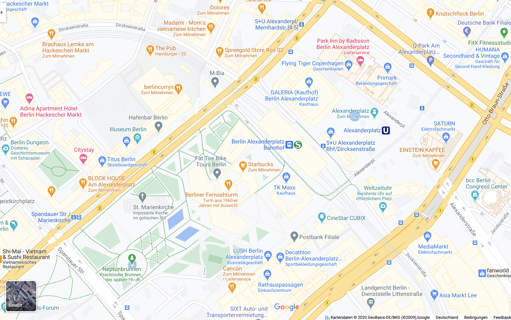

This example should demonstrate that a model is only there to capture the essential parts of an entity in the real world.
If we try to model out every aspect then it is harder to focus on the _important_ parts of a model.

#### Tools to draw UML Diagrams

[Draw.io](http://www.draw.io) is a easy to use website which has many predefined symbols and icons


If you prefer something declaratively then try [PlantUML](http://www.plantuml.com). All diagrams in this script
were created with PlantUML. You can find the sources for the diagrams in the [diagrams](./../../bin/diagrams) directory.

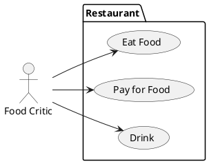

Declaration for the Use Case diagram below.

## Use Case Diagram

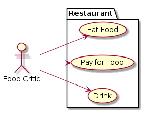

The purpose of the use case diagram is to model out:
- all relevant actors inside a use case
- the system context
- the actions (i.e. use cases) an actor can do

In the above example the system context is `Restaurant` in which the actor `Food critic` can
- `Eat Food`
- `Pay for Food`
- `Drink`

### Notation


### Include vs Extend Relationship


The difference between an 'include' vs 'exclude' use case relationship is: 'include' means that a use case is automatically part
of another use case, in the example above: when opening a book, reading is included as a use case.

'exclude' is something optional - in the above example one can open a book and _optionally_ turn a page.

### Examples


## Class Diagram

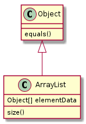

Class diagrams are representing

- the hierarchical structure of a system  
- the attributes and methods of classes and interfaces
- the relationships between classes and interfaces

### Notation


### Attributes and Methods

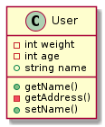

Methods have a `()` in their name. Attributes have a name and a type information, e.g. `int age`.

UML Visibility Notation
```
- private member
+ public member
# protected member
```

In the above example the weight and age attributes of a User are private, whereas the name is public.
The methods getName() and setName() are public whereas getting the address is private.

### Relationships and Associations

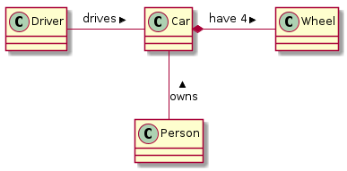

Interpretation of the Diagram:

A driver drives a car.  
A car has 4 wheels.  
A person owns a car.  

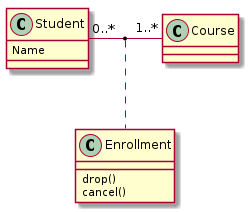

Explanation: 0 - n students can be enrolled in a course.

### Aggregations and Compositions

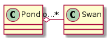

A aggregation expresses a "has"-relationship. In the above the pond has none or n swans.

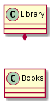

A composition expresses a "owns"-relationship. A library owns books.

### Inheritance

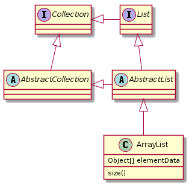

In order to model out generalizations, unfilled arrows are pointing from the implementation to the parent class which can in turn be 
a class, an abstract class or an interface.

In the above example we can see that ArrayList is fundamentally a Collection since it inherits from AbstractList which in turn
inherits from List which extends the Collection interface.

### Examples


## Sequence Diagram

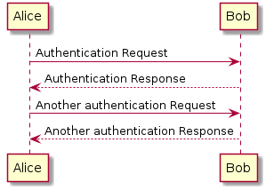

The UML defines the following properties of interaction diagrams in general:

- Interactions
- Lifelines
- Messages
- Communication Partner
- Message flow elements
 
_Note that there are multiple interaction diagrams existing in UML with different focuses and goals. Here we
will look at Sequence diagrams since one would encounter them usually more often than other interaction diagram types._

A sequence diagram mainly describes interactions between objects in a system.

#### Object Dimension
The horizontal axis shows the elements that are involved in the interaction
Conventionally, the objects involved in the operation are listed from left to right according to when they take part in the message sequence. However, the elements on the horizontal axis may appear in any order

#### Time Dimension
The vertical axis represents time proceedings (or progressing) down the page.

### Notation


#### Actor


A type of role played by an entity that interacts with the subject (e.g., by exchanging signals and data)
external to the subject (i.e., in the sense that an instance of an actor is not a part of the instance of its corresponding subject).
represent roles played by human users, external hardware, or other subjects.

#### Lifeline


A lifeline represents an individual participant in the Interaction.

#### Activations
     

     
A thin rectangle on a lifeline) represents the period during which an element is performing an operation.
The top and the bottom of the of the rectangle are aligned with the initiation and the completion time respectively

#### Call Message


     
A message defines a particular communication between Lifelines of an Interaction.
Call message is a kind of message that represents an invocation of operation of target lifeline.

#### Return Message


     
A message defines a particular communication between Lifelines of an Interaction.
Return message is a kind of message that represents the pass of information back to the caller of a corresponded former message.

### Examples


## State Diagram


A state machine diagram models the behaviour of a single object, specifying the sequence of events that an object goes through during its lifetime in response to events.

#### States


A state is denoted by a round-cornered rectangle with the name of the state written inside it.
     
#### Initial and Final States


The initial state is denoted by a filled black circle and may be labeled with a name. The final state is denoted by a circle with a dot inside and may also be labeled with a name.

#### Transitions


Transitions from one state to the next are denoted by lines with arrowheads. A transition may have a trigger, a guard and an effect, as below.

### Notation


### Examples


