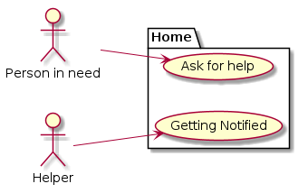
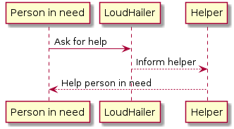

[Lectures](../../README.md#school-lectures)
[Exercises](./exercise/README.md)

# Lecture 5 -  Case Study - Implementing an `Alerting Service`

Content:
- Problem Definition
- Architecture
- Rollout
- Further Improvements

## Problem Definition
LoudHailer is a voice recognition and alerting service to help people getting help when they are in need.

[https://github.com/qaismyname/Loudhailer](https://github.com/qaismyname/Loudhailer)





## Architecture


### Akka Streams (Scala)


Schematic structure of [Akka streams](https://doc.akka.io/docs/akka/current/stream/index.html) applications 

### Backend

```Scala
Source.tick(0 second, 5 seconds, ())
        .map(sample)
        .map(analyse)
        .runForeach(act)
```

```Scala
def sample: Unit => Sample = _ => SoundRecorder.sample
```

```Scala
def analyse: Sample => Future[Hypothesis] = {
    case Xor.Left(e) => Future.failed(e)
    case Xor.Right(data) =>
      for {
        response <- request(data)
        hypothesis <- Unmarshal(response.entity).to[Hypothesis]
      } yield hypothesis
  }
  
def request: Array[Byte] => Future[HttpResponse] = data =>
  Http().singleRequest(HttpRequest(
    method = HttpMethods.POST,
    uri = witUrl,
    headers = List(headers.RawHeader("Authorization", s"Bearer $witToken")),
    entity = HttpEntity(contentType = `audio/wav`, data)))
```

```Scala
def act: Future[Hypothesis] => Unit = f => {
    f.onComplete {
      case Success(h) => if (blackList.contains(response.hypothesis)) broadcastEvent()
      case Failure(e) => e.printStackTrace()
    }
  }
  
def broadcastEvent() = {
    val body = Map(
      "to" -> "/topics/alert".asJson,
      "data" -> Map(
        "message" -> "An incident occurred.".asJson
      ).asJson
    ).asJson

    Http().singleRequest(
      HttpRequest(
        method = HttpMethods.POST,
        uri = fireBaseUrl,
        headers = List(headers.RawHeader("Authorization", s"key=$fireBaseToken")),
        entity = HttpEntity(contentType = `application/json`, body.noSpaces)))
  }
```


### [wit.ai API](https://wit.ai/docs/http/20200513/#post__speech_link)


[Source](https://github.com/qaismyname/Loudhailer/blob/master/voice-recognition-stream/src/main/scala/github/qabbasi/loudhailer/SoundRecorder.scala)

### [Firebase Cloud Messaging](https://firebase.google.com/docs/cloud-messaging)


### Mobile (Android Kotlin)

```Kotlin
class MyFirebaseMessagingService : FirebaseMessagingService() {

    override fun onMessageReceived(remoteMessage: RemoteMessage?) {

        // Check if the message contains a data payload.
        if (remoteMessage != null && remoteMessage.data.size > 0) {
            val message: String? = remoteMessage.data["message"]
            if (message != null)
                sendNotification(message)
        }

    }

    private fun sendNotification(message: String) {
        val intent = Intent(this, AlarmActivity::class.java)
        intent.addFlags(Intent.FLAG_ACTIVITY_CLEAR_TOP)
        intent.addFlags(Intent.FLAG_ACTIVITY_NEW_TASK)
        intent.putExtra(AlarmActivity.MESSAGE, message)
        startActivity(intent)
    }
```

```xml
 <activity android:name=".MainActivity">
    <intent-filter>
        <action android:name="android.intent.action.MAIN" />
        <category android:name="android.intent.category.LAUNCHER" />
    </intent-filter>
</activity>

<service android:name=".MyFirebaseMessagingService">
    <intent-filter>
        <action android:name="com.google.firebase.MESSAGING_EVENT" />
    </intent-filter>
</service>

<activity
    android:name=".AlarmActivity"
    android:configChanges="orientation|keyboardHidden|screenSize"
    android:label="@string/title_activity_alarm"
    android:theme="@style/FullscreenTheme">
</activity>
```

[Source](https://github.com/qaismyname/Loudhailer/blob/master/LoudHailerClient/app/src/main/AndroidManifest.xml)


## Rollout

-

## Further Improvements

-
